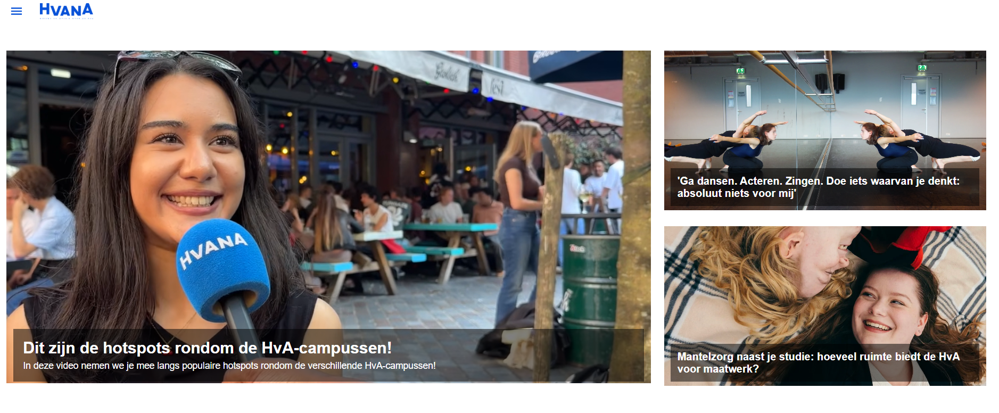

# The Client - Website

Ontwerp en maak een website voor een opdrachtgever en bespreek het resultaat tijdens de Sprint Review.

De instructie van deze leertaak staan in de [WIKI](https://github.com/fdnd-task/the-client-website/wiki)

## Inhoudsopgave

  * [Beschrijving](#beschrijving)
  * [Kenmerken](#kenmerken)
  * [Bronnen](#bronnen)
  * [Licentie](#licentie)
  

## Beschrijving
Voor HvanA heb ik een nieuw ontwerp gemaakt van de Home pagina. 

https://rayhana7.github.io/the-client-website/

## Kenmerken
De site is gebouwd met HTML en CSS

### HTML 
Test
#### Header
Test
#### Main
Test

### CSS 
Met de CSS heb ik de pagina vormgegeven. 

#### Responsive gedrag

## Licentie

This project is licensed under the terms of the [MIT license](./LICENSE).
